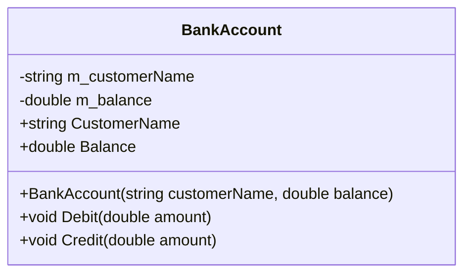

# Diagrama de Clases

```mermaid
classDiagram
    class BankAccount {
        -string m_customerName
        -double m_balance
        +string CustomerName
        +double Balance
        +BankAccount(string customerName, double balance)
        +void Debit(double amount)
        +void Credit(double amount)
    }
```

